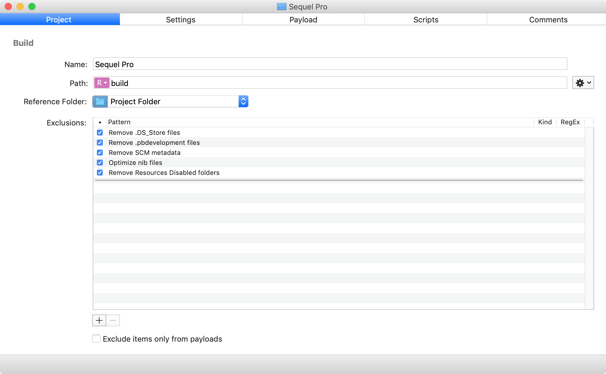
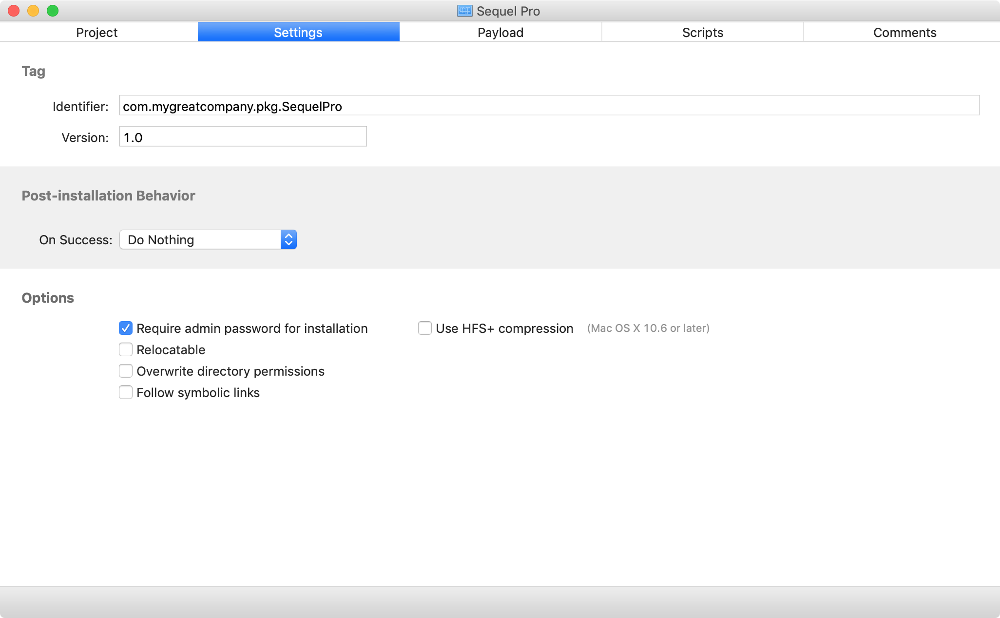
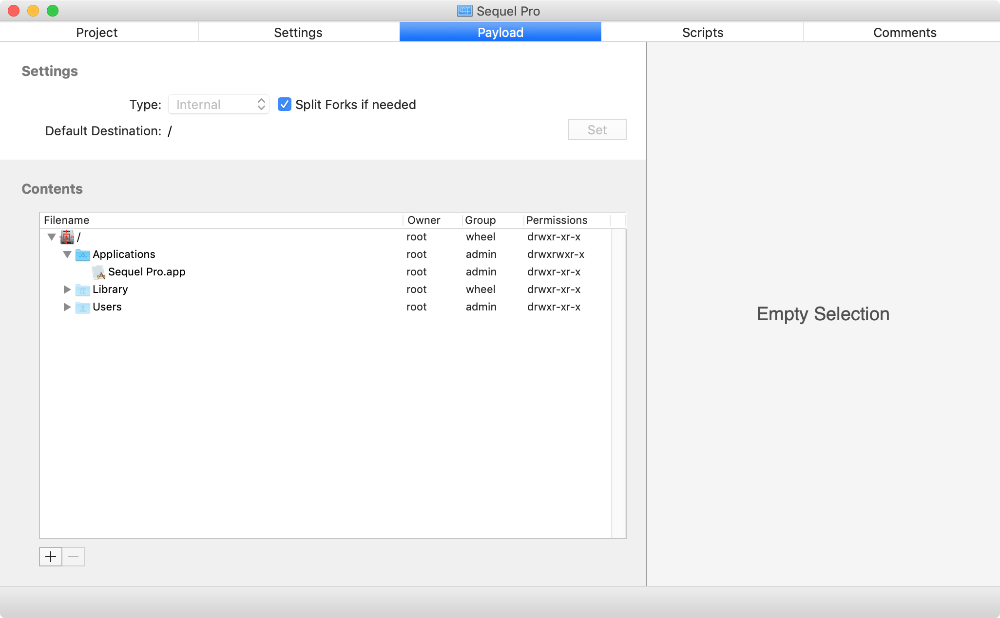
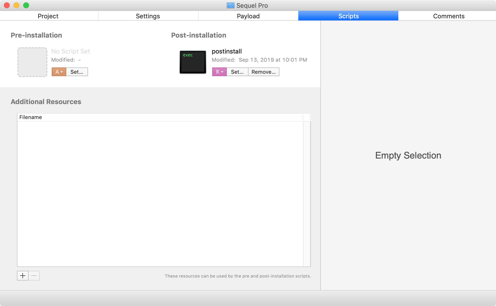

Deploy Sequel Pro with a pre-defined bookmark for a specified database server and do not overwrite any existing bookmarks. Password does not need to be included.

Tools used:

* Packages: [http://s.sudre.free.fr/Software/Packages/about.html](http://s.sudre.free.fr/Software/Packages/about.html)
* BBEdit: [https://www.barebones.com/products/bbedit/](https://www.barebones.com/products/bbedit/)
* PlistBuddy: [https://www.manpagez.com/man/8/PlistBuddy/](https://www.manpagez.com/man/8/PlistBuddy/)

A. Install Packages if not already present.

B. Install BBEdit if not already present.

C. Write a `postinstall` script to accomplish the following goals:

1. Detect if there is an existing Favorites.plist for Sequel Pro at a specified location in user account folders or user template directories.
2. Deploy a pre-configured Favorites.plist for Sequel Pro to those user accounts or user template directories that did not have one.
3. Edit existing Favorites.plist files to add the specified bookmark.

[https://gist.github.com/rtrouton/2709c2ccac60acb942e1535cc3dd522a](https://gist.github.com/rtrouton/2709c2ccac60acb942e1535cc3dd522a)

For more information on editing existing Sequel Pro Favorites.plist files, please see the link below:

[https://blog.eexit.net/osx-dealing-with-property-list-files/](https://blog.eexit.net/osx-dealing-with-property-list-files/)

D. Build installer package with Packages which deploys Sequel Pro to the `/Applications` directory and runs the `postinstall` script referenced above.

E. Verify that both Sequel Pro and the bookmark deployed correctly.